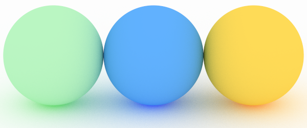
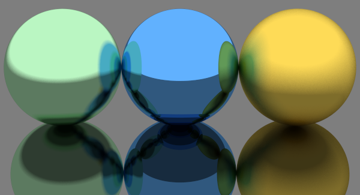
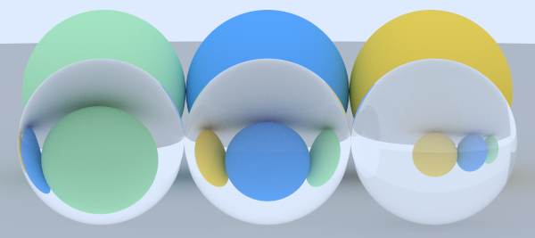
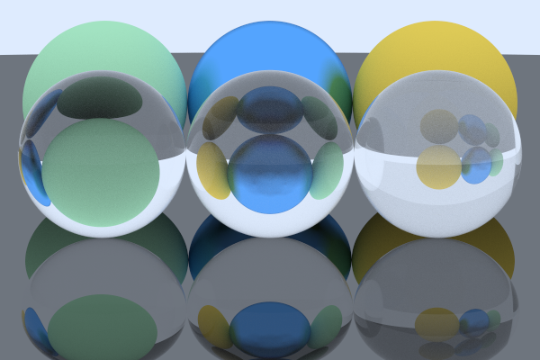

## 1. Introducción y objetivos

> En este apartado se establecerá el contexto y la motivación del trabajo, explicando la importancia de la síntesis de hologramas digitales generados por computador (CGHs) y el papel del trazado de rayos en el proceso. También se definirán los objetivos del TFG, incluyendo la creación de escenas sintéticas, la creación de un trazador de rayos clásico, su adaptación para generar hologramas y la propagación del frente de ondas para validar los resultados.

## 2. Estado del arte

## 3. Proceso de síntesis de escenas virtuales en 3D mediante hologramas digitales

En este apartado se detallará el proceso de síntesis, dividido en tres secciones:

### 3.1. Definición de la escena virtual

El primer paso para la síntesis de escenas virtuales consiste en definir la escena que se desea producir. Veamos el siguiente ejemplo:

> Imagen de ejemplo

> Hablar de la interfaz
#### 3.1.1. Geometría

La geometría de la escena se definirá mediante primitivas definidas matemáticamente. Estas primitivas son: triángulos, definidos mediante la posición espacial de sus vértices; y esferas, definidas mediante su radio y la posición espacial de su centro. 

Utilizando la primitiva del triángulo se pueden representar mallas, definidas por una lista de triángulos. El soporte de mallas resulta muy útil ya que la mayoría de modelos 3D se encuentra en este formato. Para la importación de las mallas se ha utilizado la librería "tinyobjloader", la cual permite cargar archivos OBJ y extraer los vertices de sus triángulos.

> Imagen de esfera {c r}, y triangulo {a b c}

#### 3.1.2. Textura

Una vez definida la geometría de la escena, es necesario aplicar texturas a las primitivas. Las texturas que se han utilizado no siguen el significado tradicional de imágenes bidimensionales mapeadas sobre la superficie de la geometría, si no que se emplean distintos tipos de materiales, detallados a continuación:

1. Material difuso (lambertiano): Este material dispersa la luz siguiendo una distribución independiente al ángulo de incidencia y proporcional al coseno del ángulo formado entre la normal de la superficie y la dirección de dispersión. Esta distribución viene dada por la ley del coseno de Lambert. El color y la intensidad de la luz se ven modificados por el color (o albedo) del material. Este material podría describirse como mate. En la figura X se puede apreciar el comportamiento del material difuso. 

|                                                                                 |
|:---------------------------------------------------------------------------------------------------------:|
| *Figura X: Render de tres esferas de diferentes colores sobre una superficie blanca. Materiales difusos.* |

2. Material metálico: Al contrario que el material difuso, el material metálico refleja la luz en el mismo ángulo en dirección opuesta respecto al ángulo de incidencia. Este efecto produce un reflejo de la misma manera que un espejo. Este material también cuenta con un parámetro que controla la borrosidad (o fuzziness, en inglés) del reflejo. En la figura X se puede observar el efecto espejo del material junto a el parámetro de borrosidad.

|                                                                                                                                                                   |
|:-------------------------------------------------------------------------------------------------------------------------------------------------------------------------------------------:|
| *Figura X: Render de tres esferas de diferentes colores sobre una superficie gris. Materiales metálicos con distinta borrosidad: 0.1 (izquierda), 0 (centro y superficie) y 0.5 (derecha).* |

3. Material dieléctrico: Este material representa materiales transparentes como agua y cristal. Cuando la luz incide sobre el material, se divide en luz reflejada (como el material metálico) y en luz refractada. La reflectividad se describe según las ecuaciones de Fresnel y la refracción según la ley de Snell. Este material también cuenta con un parámetro que controla el índice de refracción. En la figura X se puede apreciar el efecto de distintos índices de refracción. Tambien se puede observar la luz refractada en la bola de la derecha debido a un índice de refracción elevado. Cabe estacar que las bolas de materiales dieléctricos no tienen sombra, se puede comprobar que ese es el caso observando una bola de cristal en un día nublado.

|                                                                                                                                                                                                                             |
|:-----------------------------------------------------------------------------------------------------------------------------------------------------------------------------------------------------------------------------------------------------:|
| *Figura X: Render de tres bolas con un material dieléctrico y tres esferas de distintos colores, sobre una superficie gris. Los indices de refracción de las tres bolas son: 1.3 (agua, izquierda), 1.5 (cristal, centro) y 2.4 (diamante, derecha).* |

También existen otras formas mas completas de definir materiales como las descritas en los modelos de [Disney](https://media.disneyanimation.com/uploads/production/publication_asset/48/asset/s2012_pbs_disney_brdf_notes_v3.pdf), [Autodesk](https://autodesk.github.io/standard-surface/#closures) o [OpenPBR](https://academysoftwarefoundation.github.io/OpenPBR/).

|                                                                                                                                             |
|:--------------------------------------------------------------------------------------------------------------------------------------------------------------------------:|
| *Figura X: Render demostrando los distintos materiales. Basado en el render de la figura X-1 (superficie y esfera azul metálicas con borrosidad 0 y 0.3 respectivamente).* |

#### 3.1.3. Iluminación

La ultima sección de la definición de la escena virtual es la iluminación. La iluminación que se utiliza se puede dividir en dos tipos de fuente: el cielo y fuentes puntuales de luz.

El cielo ilumina de manera uniforme la escena mientras que las fuentes de luz puntuales siguen el modelo de reflexión de Blinn-Phong, que describe la forma en la que una superficie refleja la luz como una combinación de la iluminación difusa y la iluminación especular. No se incluye el término ambiental del modelo ya que se utiliza el cielo.

> Imagen de la escena de iluminación con los tres componentes y la suma de ellos

### 3.2. Generación de hologramas digitales (DH)

#### 3.2.1. Trazado de rayos

> En este apartado se detallará el algoritmo de trazado de rayos utilizado para generar imágenes, explicando cómo se simulan los rayos de luz desde la fuente hasta el detector y las principales diferencias con la realidad. (cámara, generación de rayos, muestreo, intersección, interacción con materiales, número máximo de rebotes, iluminación) (Referencias a los libros) (Imágenes de los resultados, la del final del primer libro y alguna malla)

El trazado de rayos (o ray tracing, en inglés) es una técnica para simular el comportamiento de la luz para sintetizar escenas virtuales. En este trabajo concretamente se utiliza el algoritmo de trazado de caminos (o path tracing, en inglés), el cual simula más efectos que el trazado de rayos convencional gracias al uso de simulaciones de Monte Carlo.

El trazado de rayos se considera una técnica computacionalmente costosa, por lo que es utilizada principalmente para crear imágenes generadas por computador (CGI) estáticas y efectos visuales.

> Quizás hablar de BDRF (Bidirectional reflectance distribution function)

Según el libro[ Physically Based Rendering: From Theory To Implementation](https://pbr-book.org/4ed/contents) un trazador de rayos ha de simular al menos los siguientes objetos y fenómenos:

+ Camaras: El modelo de una camara determina cómo y desde dónde la escena es observada, incluyendo como una imagen de la escena es recogida por un sensor.
+ Intersecciones rayo-objeto: Es necesario conocer precisamente cuándo y dónde un rayo intersecta un objeto geométrico, además de determinar algunas propiedades del objeto en el punto de intersección.
+ Fuentes de luz: El trazador de rayos ha de modelar la distribución de la luz en la escena.
+ Visibilidad: Se debe poder conocer si una luz determinada deposita energía en un punto de una superficie.
+ Dispersion de la luz en superficies: Cada objeto ha de proveer información sobre como la luz interactúa con la superficie del objeto.
+ Transporte indirecto de luz: La luz puede llegar a la superficie después de rebotar o atravesar otras superficies.
+ Propagación de rayos: Se necesita conocer el comportamiento de la luz mientras atraviesa un espacio, siendo constante en el vacío.

A continuación se detallará el el funcionamiento de la implementación realizada en este trabajo.

##### Implementación

El algoritmo se ha implementado en el lenguaje de programación C++ debido a su alto rendimiento, control sobre conceptos de bajo nivel (como gestion de la memoria) y compatibilidad con CUDA para acelerar mediante GPUs. La implementación inicial se ha basado en el libro [Ray Tracing in One Weekend](https://raytracing.github.io/books/RayTracingInOneWeekend.html) y se han añadido más funcionalidades no incluidas en el libro.

El primer componente del trazador de rayos es la cámara, encargada de _lanzar_ los rayos ya que la propagación desde la fuente de luz hasta la cámara es equivalente a la propagación desde la cámara hasta la fuente de luz. La camara se basa en una cámara estenopeica (o camara oscura) sin lente aunque también es capaz de simular una lente para obtener el efecto de profundidad de campo.

> Imagen de cámara similar a: [pbr figure 1.2 y figure 1.3](https://pbr-book.org/4ed/Introduction/Photorealistic_Rendering_and_the_Ray-Tracing_Algorithm#CamerasandFilm) y/o lente de RTIOW

La camara se define mediante su centro y su viewport. El centro de la camara es el punto (o el centro del disco en el caso de simular una lente) desde el cuál se originan los rayos. El viewport es un rectángulo bidimensional discretizado en píxeles utilizado para proyectar la escena. Cada pixel del viewport se corresponde con el de la imagen de salida por lo que se podría hacer un símil con el sensor de la cámara. Cada píxel indica la dirección de un rayo y una vez trazado el rayo se almacena el color resultante en la imagen de salida. Se puede obtener mayor calidad perceptual al elegir un punto aleatorio dentro del pixel en vez de su centro y se puede reducir el aliasing y aumentar la calidad al mediar el resultado de varias muestras del pixel.

> Imagen centro-viewport con pixeles (similar a figura 3 RTIOW)

Una vez lanzado el rayo se comprueba si intersecta con algún objeto de la escena iterando sobre ellos y se selecciona el objeto intersectado más cercano. De la intersección se obtiene el punto, la distancia respecto al origen del rayo, la normal de la superficie y el material del objeto. Con esta información, para la iluminación ambiente, se puede calcular la atenuación y la dirección del rayo dispersado dependiendo del material. Este proceso se repite hasta que el rayo dispersado no intersecta ningún objeto (o "escapa") y se atenúa con el color del cielo o, si alcanza el numero máximo de rebotes definido por el trazador de rayos, la atenuación sería total. Y para la iluminación puntual, siguiendo la misma ruta del rayo de la iluminación ambiente, se comprueba si el punto es visible para la fuente de luz trazando un rayo nuevo y, si lo es, se calcula la iluminación especular y la iluminación difusa, esta última en el caso de que el material sea difuso. 

> Referencia a la imagen de la sección de iluminación.

> Diagrama con la iluminación especular, lambert, metal y dieléctrico, similar a Wikipedia y RTIOW.

> Imagen del final del libro 1 como demostración del trazador.

#### 3.2.2. Calculo de amplitud y fase: aproximación escalar de la propagación de ondas electromagnéticas

> En este apartado se explicará el proceso de modificación del trazador de rayos descrito en el apartado anterior para el cálculo de la amplitud y la fase de las ondas electromagnéticas. (SLM, nubes de puntos, obtención de la amplitud y fase) (Referencias a los estudios) (Imágenes de los resultados, preferiblemente con poco ruido)

> El nombre de la sección suena muy complicado

Una vez implementado un trazador de rayos para la generación de imágenes, se ha modificado para generar hologramas. Las principales modificaciones realizadas han sido el proceso de lanzar rayos y el cambio del calculo del color del rayo a la amplitud y fase.

Para obtener la amplitud y la fase de cada pixel \[del SLM] se ha de calcular respecto a cada punto a muestrear, siendo los mismos puntos para cada pixel por razones relacionadas con la coherencia. Para determinar estos puntos se ha utilizado la técnica de la nube de puntos, según la cual se crea una lista de puntos en las superficies de los objetos.

> Mencionar cálculos

> Listar limitaciones respecto al CGI (dieléctricos, triángulos?, iluminación ambiental), preguntar por "po distance" 

### 3.3 Reconstrucción de la escena

> En este apartado se explicará brevemente el proceso de propagación de ondas electromagnéticas entre dos planos mediante convolución y el uso de las transformadas de Fourier. (Referencia al estudio) (Imágenes de los resultados a diferentes distancias)

> Quizás introducir el setup del laboratorio.

Se han utilizado dos procesos para la reconstrucción de la escena una vez obtenido el holograma: simulación mediante la propagación de ondas electromagnéticas entre dos planos según el método de espectro angular (o angular spectrum method of plane waves, en inglés) mediante convolución en el dominio de la frecuencia y propagación en el laboratorio \[gracias a un SLM y un laser]. 

La simulación se ha llevado a cabo utilizando Python como lenguaje de programación junto a la librería de computo científico NumPy.

La propagación en el laboratorio se ha realizado...

> Referencia al estudio con el kernel

> Imágenes con propagaciones a distintas distancias y comparativa entre simulación y realidad.

## 4. Técnicas de paralelización

La computación paralela es un tipo de computación en la que muchos cálculos o procesos se llevan a cabo simultáneamente. Existen varias técnicas de paralelización dentro de la computación paralela entre las que se encuentra la que se utilizará en este trabajo, el paralelismo de datos. Esta técnica consiste en dividir los datos entre distintos núcleos de procesamiento, los cuales operan sobre los datos en paralelo. Por ejemplo, se podría dividir una imagen en píxeles, y operar a nivel de pixel.

### 4.1 CPU

> En este apartado explicará el modelo de ejecución de las CPUs y de cómo aprovechar los diferentes núcleos mediante el uso de hilos (threads) y grupos de hilos (threadpools). (Comparación entre ambos en el caso de trazado de rayos tradicional y CGH) (Hablar de SIMD (Single Instruction Multiple Data) en algún momento o que el compilador optimiza.

Las CPUs actuales cuentan con multiples núcleos, lo que permite la ejecución paralela de múltiples hilos. Cada núcleo puede ejecutar una serie de instrucciones de manera independiente, permitiendo la realización de tareas en paralelo.

Para aprovechar los diferentes núcleos de la CPU es necesario dividir el trabajo para diferentes hilos (o threads, en inglés). En el caso de un trazador de rayos, el método mas sencillo de distribuir el trabajo es dividiendo la imagen en píxeles y asignando a cada hilo un rango de píxeles sobre los que operar. Este método cuenta con la limitación de que puede darse el caso de que un hilo acabe antes que otro, limitando el aumento de velocidad al hilo más lento. 

Para solucionar este problema se puede introducir el uso de un grupo de hilos (o thread pool, en inglés), al cuál se le puede asignar una serie de tareas que los hilos que lo forman ejecutan. Al dividir el trabajo en más tareas que hilos, se soluciona la limitación anterior. Se ha de tener en cuenta que la gestión de los hilos y las tareas tiene un coste computacional.

En el trazador de rayos implementado se ha dividido la imagen en líneas de píxeles y se ha optado por el uso de un grupo de hilos mediante la librería [BS::thread_pool](https://github.com/bshoshany/thread-pool). La elección se debe principalmente a que el primer hilo suele terminar mucho antes que el último ya que en la mayoría de las escenas no se incluyen objetos en la parte superior. Esto no ocurre en el caso del trazador de rayos modificado para generar hologramas, ya que cada pixel lanza un rayo a cada punto y los hilos terminan con menor varianza. Por este motivo y por el coste extra del grupo de hilos, se ha optado por el uso de hilos en la generación de hologramas.

> Considerar si mencionar OpenMP o eliminar la dependencia del proyecto.
 

### 4.2 GPU

> En este apartado se explicará el modelo de ejecución de las GPUs junto con las distintas formas de comunicarse con la GPU (shaders, OpenCL, CUDA, otros lenguajes), centrándose en la utilización de CUDA y sus limitaciones. (diferencia código y memoria host/device, limitación a tarjetas Nvidia) (Referencia a tabla de arquitecturas CUDA) (mencionar numero de registros fp32 y fp64) (SIMD masivo)

## 5. Resultados

### 5.1. Tablas comparativas de tiempos.

> En este apartado se detallará el hardware utilizado (CPUs y GPUs) y se realizaran comparativas entre distintas combinaciones. (CPU1 vs CPU2 vs GPU1 vs GPU2) Tanto RT como CGH (con y sin VBH (optimización Volume Binding Hierarchy)) (Diferentes resoluciones o número de puntos)

> Buscar otro nombre

### 5.2. Imágenes simuladas

> (Imágenes con más calidad, Imágenes utilizadas en el apartado anterior)

### 5.3. Imágenes obtenidas en el laboratorio

> (Comparativa entre laboratorio y simulación (CGI con blur?))

## 6. Conclusiones

## 7. Trabajo futuro

## 8. Bibliografía

- https://pbr-book.org/
- https://raytracing.github.io/
- https://developer.nvidia.com/blog/accelerated-ray-tracing-cuda/
- https://www.youtube.com/watch?v=KkOkx0FiHDA

---

- https://en.wikipedia.org/wiki/General-purpose_computing_on_graphics_processing_units
- https://en.wikipedia.org/wiki/Ray_tracing_(graphics)
- https://en.wikipedia.org/wiki/Angular_spectrum_method

## 9. Anexos

### 9.1. Licencias

### 9.2. Repositorios

---
## Notas
### Precios HW
Obtenidos a 23/05/2024 
* 9900K 
	* Fecha de salida: Q4'18
	* Precio de salida: 560 €
	* Precio actual (11900F): 275€ [Fuente](https://www.pccomponentes.com/intel-core-i9-11900f-25-ghz)
* 7700K
	* Fecha de salida: Q1'17
	* Precio de salida: 410€
	* Precio actual (11700K): 248€ [Fuente](https://www.pccomponentes.com/intel-core-i7-11700k-36-ghz) 
* 2060
	* Fecha de salida: Q1'19
	* Precio de salida: 349€
	* Precio actual (3060):  290€ [Fuente](https://www.pccomponentes.com/asus-dual-geforce-rtx-3060-oc-edition-v2-12gb-gddr6)
* 3070
	* Fecha de salida: Q4'20
	* Precio de salida: 519€
	* Precio actual: 526€ [Fuente](https://www.pccomponentes.com/gigabyte-geforce-rtx-3070-gaming-oc-lhr-v2-8gb-gddr6)
